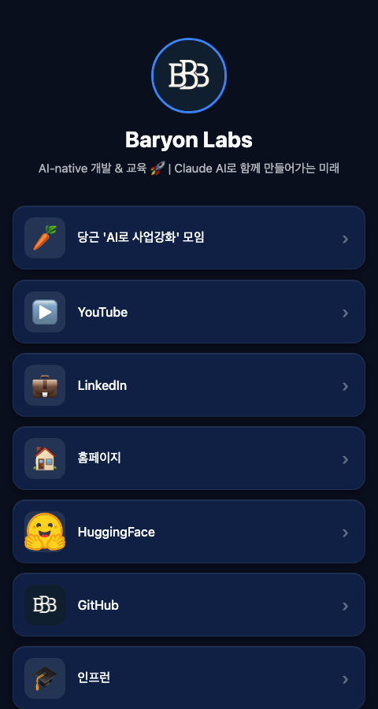

<div align="center">
  
  <h1>Free Linkmoa 🔗</h1>
  <p><strong>AI-Native 링크 관리 서비스 — 자연어로 편집, 자동 배포</strong></p>

  [](https://github.com/baryonlabs/free-linkmoa/actions/workflows/pages.yml)
  [](https://github.com/baryonlabs/free-linkmoa/actions/workflows/sync-content.yml)
  [](LICENSE)
</div>

---

## 데모

| 배포 방식 | 링크 | 특징 |
|-----------|------|------|
| **GitHub Pages** (정적) | [baryonlabs.github.io/free-linkmoa](https://baryonlabs.github.io/free-linkmoa/) | YAML 수정 → 자동 빌드 |
| **Vercel + Turso** (풀스택) | [free-linkmoa.vercel.app](https://free-linkmoa.vercel.app) | Next.js + SQLite Edge DB |

<div align="center">
  <a href="https://baryonlabs.github.io/free-linkmoa/">
    
  </a>
  &nbsp;
  <a href="https://free-linkmoa.vercel.app">
    
  </a>
</div>

---

## 이런 서비스입니다

인스타, 유튜브, GitHub 등 내 링크를 한 곳에 모아서 관리하는 **링크인바이오** 서비스를
**Claude Code(AI)에게 말만 하면** 알아서 수정하고 배포합니다.

```
나: "당근 모임 링크 추가해줘 https://..."
        ↓
Claude: config.yml 수정 → git commit → git push
        ↓
GitHub Actions: 자동 빌드 → 배포 완료 (약 1분)
```

### 주요 기능

- **마우스 추적 3D 틸트** — 카드가 마우스 방향으로 입체감 있게 기울어짐
- **썸네일 + 이모지** — 링크마다 이미지 또는 큰 이모지 표시
- **YAML 기반 CMS** — 코드 없이 파일 하나로 전체 콘텐츠 관리
- **이중 배포** — GitHub Pages(정적) + Vercel(풀스택) 동시 지원
- **AI 자연어 편집** — Claude Code에 말로 요청하면 자동 반영

---

## 스크린샷

> 아래 링크에서 라이브로 확인하세요.

| GitHub Pages (정적 사이트) | Vercel 앱 (풀스택) |
|:---:|:---:|
| [](https://baryonlabs.github.io/free-linkmoa/) | [](https://free-linkmoa.vercel.app) |
| [baryonlabs.github.io/free-linkmoa](https://baryonlabs.github.io/free-linkmoa/) | [free-linkmoa.vercel.app](https://free-linkmoa.vercel.app) |
| YAML 수정만 하면 자동 배포 | 대시보드 + API + DB 포함 |

---

## 폴더 구조

```
free-linkmoa/
│
├── 📁 gh-pages/               # 실습 0: GitHub Pages 정적 사이트
│   ├── config.yml             #   ✏️ 여기만 수정하면 끝 (프로필, 링크, 테마)
│   └── build.mjs              #   YAML → HTML 빌드 스크립트
│
├── 📁 linkflow/               # 실습 1: Vercel + Turso 풀스택 앱
│   ├── content.yml            #   ✏️ 수정 → push → Vercel 자동 반영
│   └── apps/web/              #   Next.js 앱 (API, 대시보드, 공개 프로필)
│
├── 📁 practices/              # 향후 실습 공간
│   ├── 02-fly-io/             #   실습 2: Fly.io 컨테이너 배포 (예정)
│   ├── 03-cloudflare-pages/   #   실습 3: Cloudflare Pages + D1 (예정)
│   └── 04-docker-compose/     #   실습 4: 로컬 Docker 풀스택 (예정)
│
├── 📁 docs/                   # 문서
│   └── workflow.md            #   실습 워크플로우 상세 가이드
│
├── 📁 scripts/                # 공용 설정 스크립트
│   ├── sync-content.sh        #   content.yml → Vercel API 동기화
│   ├── turso-setup.sh         #   Turso DB 생성 + 스키마 마이그레이션
│   └── mcp-setup.sh           #   Claude Desktop MCP 서버 연결
│
└── .github/workflows/
    ├── pages.yml              #   GitHub Pages 자동 빌드
    └── sync-content.yml       #   content.yml 변경 시 Vercel 동기화
```

---

## 실습 목록

| # | 방식 | 폴더 | 배포 URL | 상태 |
|---|------|------|----------|------|
| 0 | GitHub Pages (정적) | `gh-pages/` | [baryonlabs.github.io/free-linkmoa](https://baryonlabs.github.io/free-linkmoa/) | ✅ 완료 |
| 1 | Vercel + Turso | `linkflow/` | [free-linkmoa.vercel.app](https://free-linkmoa.vercel.app) | ✅ 완료 |
| 2 | Fly.io | `practices/02-fly-io/` | - | 🔜 예정 |
| 3 | Cloudflare Pages + D1 | `practices/03-cloudflare-pages/` | - | 🔜 예정 |
| 4 | Docker Compose | `practices/04-docker-compose/` | - | 🔜 예정 |

---

## 5분 빠른 시작 (GitHub Pages)

### 1. 포크 & 클론

```bash
# 이 저장소를 포크한 뒤
git clone https://github.com/YOUR_USERNAME/free-linkmoa.git
cd free-linkmoa
```

### 2. `gh-pages/config.yml` 수정

```yaml
profile:
  name: "내 이름"
  bio: "내 소개글"
  avatar: "https://github.com/MY_USERNAME.png"

links:
  - title: "GitHub"
    url: "https://github.com/MY_USERNAME"
    icon: "github"
    thumbnail: "https://github.com/MY_USERNAME.png"   # 선택
    enabled: true

  - title: "YouTube"
    url: "https://youtube.com/@MY_CHANNEL"
    icon: "youtube"
    enabled: true
```

### 3. 로컬 미리보기 (선택)

```bash
cd gh-pages
npm install
node build.mjs
open ../out/index.html
```

### 4. 배포 (push → 자동)

```bash
git add gh-pages/config.yml
git commit -m "내 프로필 설정"
git push origin main
# → GitHub Actions가 자동으로 빌드 & 배포 (약 1분)
```

### GitHub Pages 활성화

저장소 `Settings → Pages → Source: GitHub Actions` 로 설정

---

## AI로 수정하기 (Claude Code)

Claude Code를 사용하면 말만 해도 자동 수정 + 배포됩니다.

```
"소개글을 'AI로 세상을 바꾸는 개발자'로 바꿔줘"
"인스타 링크 추가해줘 https://instagram.com/..."
"배경색 보라색으로 바꿔줘"
"YouTube 링크 비활성화해줘"
```

자세한 워크플로우: **[docs/workflow.md](./docs/workflow.md)**

---

## 실습 1: Vercel + Turso 시작하기

```bash
# 1. Turso DB 생성 + 스키마 적용
bash scripts/turso-setup.sh

# 2. Vercel 환경변수 설정 후 배포
vercel env add TURSO_DATABASE_URL
vercel env add TURSO_AUTH_TOKEN
vercel env add JWT_SECRET
vercel deploy --prod --cwd linkflow/apps/web
```

`linkflow/content.yml`을 수정하고 push하면 GitHub Actions가 자동으로 Vercel 앱 DB에 동기화합니다.

자세한 내용: [DEPLOY.md](./DEPLOY.md)

---

## Tech Stack

| 영역 | 기술 |
|------|------|
| 정적 사이트 | Vanilla HTML/CSS/JS, js-yaml |
| 풀스택 앱 | Next.js 14, TypeScript, Tailwind CSS |
| 데이터베이스 | Turso (LibSQL / SQLite Edge) |
| 인증 | JWT + bcryptjs |
| 배포 | GitHub Pages, Vercel |
| 자동화 | GitHub Actions |
| AI 편집 | Claude Code + linkflow skill |

---

## 관련 링크

- [인프런 챌린지 — "앱 커팅"시대! 나를 위한 앱 만들고 공유하기](https://www.inflearn.com/challenge/quot%EC%95%B1-%EC%BB%A4%ED%8C%85quot%EC%8B%9C%EB%8C%80-%EB%82%98%EB%A5%BC-%EC%9C%84%ED%95%9C?cid=341120)
- [Baryon Labs 인프런](https://www.inflearn.com/users/44011/@baryonai)
- [Baryon Labs YouTube](https://www.youtube.com/@codcatprofessor/shorts)

---

<div align="center">
  Built with ❤️ by <a href="https://labs.baryon.ai">Baryon Labs</a><br>
  Public Build · Open Source · AI-Native
</div>
