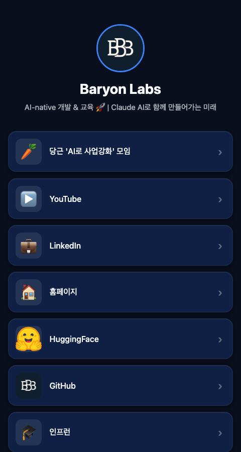
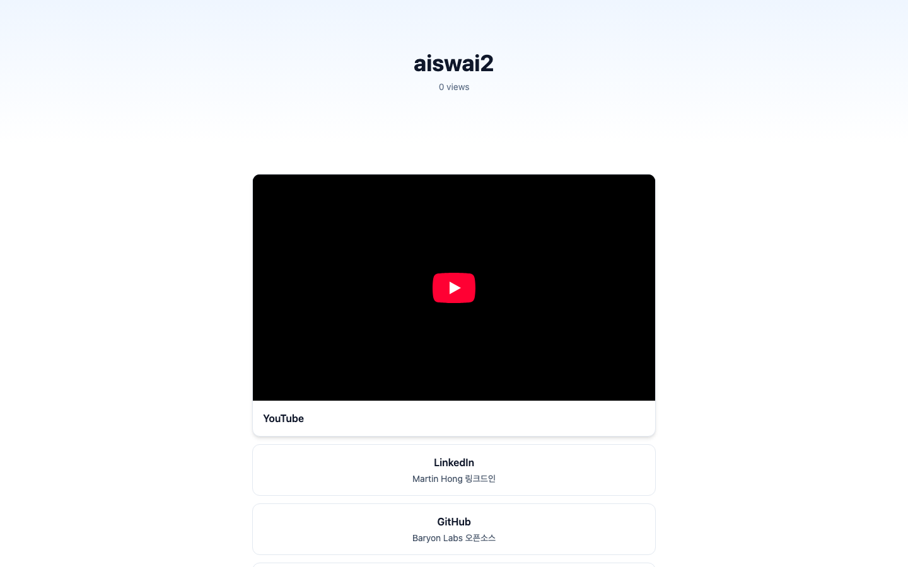
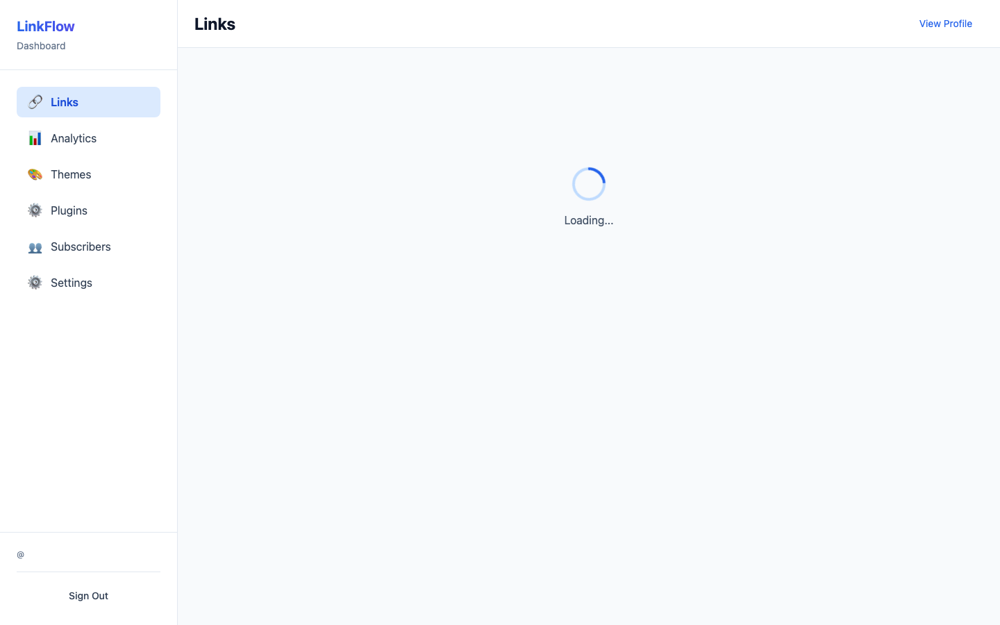
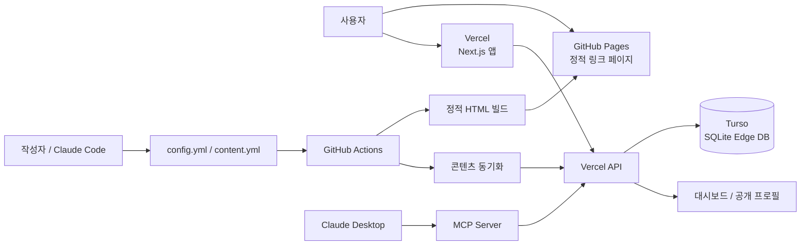
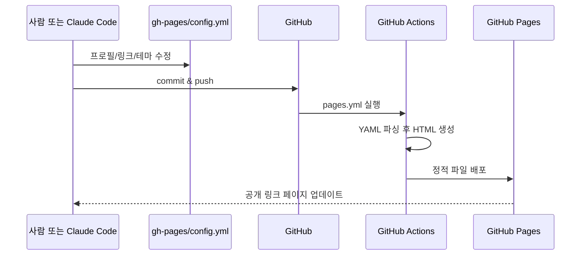
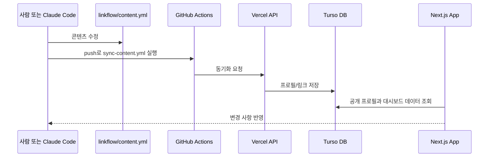

<div align="center">
  

  # Free Linkmoa

  YAML 편집, 자동 배포, MCP 제어까지 포함한 AI-Native 링크인바이오 빌더

  [](https://github.com/baryonlabs/free-linkmoa/actions/workflows/pages.yml)
  [](https://github.com/baryonlabs/free-linkmoa/actions/workflows/sync-content.yml)
  [](linkflow/LICENSE)

  [English](./README.en.md) · [GitHub Pages 데모](https://baryonlabs.github.io/free-linkmoa/) · [Vercel 데모](https://free-linkmoa.vercel.app) · [워크플로우 가이드](./docs/workflow.md)
</div>

---

## Free Linkmoa란?

Free Linkmoa는 개인 링크인바이오 페이지를 직접 수정하거나, Claude Code에게 말로 요청하거나, MCP 서버를 통해 대화형으로 관리할 수 있게 만든 공개 빌드 프로젝트입니다.

두 가지 실행 트랙을 제공합니다.

| 트랙 | URL | 용도 |
|------|-----|------|
| **GitHub Pages** | [baryonlabs.github.io/free-linkmoa](https://baryonlabs.github.io/free-linkmoa/) | `gh-pages/config.yml`에서 생성되는 정적 프로필 |
| **Vercel + Turso** | [free-linkmoa.vercel.app](https://free-linkmoa.vercel.app) | 인증, 대시보드, API, 분석, SQLite Edge DB를 갖춘 풀스택 앱 |

핵심 흐름은 단순합니다.

```text
"이 링크를 내 프로필에 추가해줘"
        ↓
Claude Code가 YAML을 수정하거나 API를 호출
        ↓
GitHub Actions / Vercel이 변경 사항 배포
        ↓
공개 링크 페이지에 바로 반영
```

## 스크린샷

| GitHub Pages | Vercel 공개 프로필 | Vercel 대시보드 |
|:---:|:---:|:---:|
| [](https://baryonlabs.github.io/free-linkmoa/) | [](https://free-linkmoa.vercel.app/aiswai2) | [](https://free-linkmoa.vercel.app/dashboard) |
| YAML 기반 정적 페이지 | 공개 프로필 페이지 | 링크 관리 대시보드 |

## 주요 기능

### YAML CMS

프로필, 링크, 아이콘, 썸네일, 테마를 하나의 YAML 파일로 관리합니다. GitHub Pages 버전은 `gh-pages/config.yml`을 사용하고, Vercel 동기화 흐름은 `linkflow/content.yml`을 사용합니다.

### 자동 배포

`main` 브랜치에 push하면 GitHub Actions가 정적 페이지를 빌드합니다. Vercel 트랙에서는 워크플로우와 스크립트를 통해 YAML 콘텐츠를 Turso 데이터베이스로 동기화할 수 있습니다.

### AI 자연어 편집

Claude Code에 말하듯 요청하면 파일 수정, 커밋, 배포 흐름까지 자연스럽게 이어갈 수 있습니다.

```text
"소개글을 'AI로 세상을 바꾸는 개발자'로 바꿔줘"
"인스타 링크 추가해줘: https://instagram.com/..."
"YouTube 링크 비활성화해줘"
"배경색을 보라색으로 바꿔줘"
```

### 풀스택 대시보드

Vercel 앱에는 회원가입, 로그인, 프로필 편집, 링크 CRUD, 드래그 앤 드롭 순서 변경, 테마 설정, 구독자 내보내기, 분석 페이지, 공개 프로필 라우트가 포함되어 있습니다.

### MCP 서버

Claude Desktop을 Vercel API와 연결하는 MCP 서버를 포함합니다. 대시보드를 클릭하지 않아도 대화만으로 링크를 조회, 생성, 수정, 정렬할 수 있습니다.

### 3D 링크 카드

정적 사이트에는 마우스 방향을 따라 움직이는 3D 틸트 카드, 썸네일 또는 이모지 fallback, 크리에이터 링크에 맞춘 프로필 레이아웃이 포함되어 있습니다.

## 아키텍처


```mermaid
flowchart LR
  User[사용자] --> Pages[GitHub Pages<br/>정적 링크 페이지]
  User --> Vercel[Vercel<br/>Next.js 앱]

  Editor[작성자 / Claude Code] --> YAML[config.yml / content.yml]
  YAML --> Actions[GitHub Actions]
  Actions --> Build[정적 HTML 빌드]
  Build --> Pages

  Actions --> Sync[콘텐츠 동기화]
  Sync --> API[Vercel API]
  API --> DB[(Turso<br/>SQLite Edge DB)]
  Vercel --> API
  API --> Dashboard[대시보드 / 공개 프로필]

  Claude[Claude Desktop] --> MCP[MCP Server]
  MCP --> API
```

## 프로세스 파이프라인

### 정적 사이트 배포


```mermaid
sequenceDiagram
  participant Human as 사람 또는 Claude Code
  participant YAML as gh-pages/config.yml
  participant Git as GitHub
  participant Actions as GitHub Actions
  participant Site as GitHub Pages

  Human->>YAML: 프로필/링크/테마 수정
  Human->>Git: commit & push
  Git->>Actions: pages.yml 실행
  Actions->>Actions: YAML 파싱 후 HTML 생성
  Actions->>Site: 정적 파일 배포
  Site-->>Human: 공개 링크 페이지 업데이트
```

### 풀스택 앱 동기화


```mermaid
sequenceDiagram
  participant Human as 사람 또는 Claude Code
  participant Content as linkflow/content.yml
  participant Actions as GitHub Actions
  participant API as Vercel API
  participant DB as Turso DB
  participant App as Next.js App

  Human->>Content: 콘텐츠 수정
  Human->>Actions: push로 sync-content.yml 실행
  Actions->>API: 동기화 요청
  API->>DB: 프로필/링크 저장
  App->>DB: 공개 프로필과 대시보드 데이터 조회
  App-->>Human: 변경 사항 반영
```

## 빠른 시작

### GitHub Pages

저장소를 포크하거나 클론합니다.

```bash
git clone https://github.com/YOUR_USERNAME/free-linkmoa.git
cd free-linkmoa
```

`gh-pages/config.yml`을 수정합니다.

```yaml
profile:
  name: "내 이름"
  bio: "내 소개글"
  avatar: "https://github.com/MY_USERNAME.png"

links:
  - title: "GitHub"
    url: "https://github.com/MY_USERNAME"
    icon: "github"
    thumbnail: "https://github.com/MY_USERNAME.png"
    enabled: true
```

로컬에서 미리 확인합니다.

```bash
cd gh-pages
npm install
node build.mjs
open ../out/index.html
```

`main` 브랜치에 push하면 배포됩니다.

```bash
git add gh-pages/config.yml
git commit -m "Update my profile"
git push origin main
```

저장소의 `Settings -> Pages -> Source: GitHub Actions` 설정을 켜면 GitHub Pages 배포가 활성화됩니다.

### Vercel + Turso

데이터베이스를 만들고 스키마를 적용합니다.

```bash
bash scripts/turso-setup.sh
```

Vercel 환경 변수를 설정하고 배포합니다.

```bash
vercel env add TURSO_DATABASE_URL
vercel env add TURSO_AUTH_TOKEN
vercel env add JWT_SECRET
vercel deploy --prod --cwd linkflow/apps/web
```

이후 `linkflow/content.yml`을 수정하고 push하면 GitHub Actions가 Vercel 앱 데이터베이스로 콘텐츠를 동기화할 수 있습니다.

자세한 배포 방법은 [DEPLOY.md](./DEPLOY.md)를 참고하세요.

## MCP 사용법

Claude Desktop 연결은 한 번만 설정하면 됩니다.

```bash
bash scripts/mcp-setup.sh
```

Claude Desktop을 재시작한 뒤 자연어로 링크를 관리합니다.

| 요청 | MCP 도구 | 동작 |
|------|----------|------|
| `내 링크 목록 보여줘` | `list_links` | 전체 링크 조회 |
| `YouTube 링크 추가해줘: https://...` | `create_link` | 링크 생성 |
| `GitHub 링크 설명 바꿔줘` | `update_link` | 링크 수정 |
| `링크 3개 한번에 추가해줘` | `create_link` x 3 | 링크 병렬 추가 |
| `프로필 소개글 수정해줘` | `update_profile` | 프로필 업데이트 |
| `링크 순서 바꿔줘` | `reorder_links` | 링크 순서 변경 |

```text
Claude Desktop -> stdio -> MCP Server -> HTTPS -> Vercel API -> Turso DB
```

## 프로젝트 구조

```text
free-linkmoa/
├── gh-pages/                 # GitHub Pages 정적 버전
│   ├── config.yml            # 프로필, 링크, 테마 콘텐츠
│   └── build.mjs             # YAML -> HTML 빌드 스크립트
├── linkflow/                 # Vercel + Turso 풀스택 앱
│   ├── content.yml           # 앱으로 동기화되는 YAML 콘텐츠
│   ├── apps/web/             # Next.js 앱, API, 대시보드, 공개 프로필
│   └── apps/mcp-server/      # Claude Desktop MCP 서버
├── practices/                # 향후 배포 실습
├── docs/                     # 워크플로우와 보조 문서
├── scripts/                  # 설정, 배포, 동기화, MCP 스크립트
└── .github/workflows/        # GitHub Pages와 Vercel 동기화 워크플로우
```

## 실습 트랙

| # | 방식 | 폴더 | 배포 | 상태 |
|---|------|------|------|------|
| 0 | GitHub Pages | `gh-pages/` | [baryonlabs.github.io/free-linkmoa](https://baryonlabs.github.io/free-linkmoa/) | 완료 |
| 1 | Vercel + Turso | `linkflow/` | [free-linkmoa.vercel.app](https://free-linkmoa.vercel.app) | 완료 |
| 2 | Fly.io | `practices/02-fly-io/` | 예정 | 예정 |
| 3 | Cloudflare Pages + D1 | `practices/03-cloudflare-pages/` | 예정 | 예정 |
| 4 | Docker Compose | `practices/04-docker-compose/` | 예정 | 예정 |

## 기술 스택

| 영역 | 기술 |
|------|------|
| 정적 사이트 | Vanilla HTML/CSS/JS, js-yaml |
| 풀스택 앱 | Next.js 14, TypeScript, Tailwind CSS |
| 데이터베이스 | Turso, LibSQL, SQLite Edge |
| 인증 | JWT, bcryptjs |
| 배포 | GitHub Pages, Vercel |
| 자동화 | GitHub Actions |
| AI 편집 | Claude Code, linkflow skill |
| MCP 서버 | `@modelcontextprotocol/sdk`, tsx |

## 문서

- [워크플로우 가이드](./docs/workflow.md)
- [배포 가이드](./DEPLOY.md)
- [Linkflow 빠른 시작](./linkflow/QUICKSTART.md)
- [MCP 서버 가이드](./linkflow/apps/mcp-server/README.md)

## 만든 계기

이 프로젝트는 바이브코딩을 설명하고 실습하기 위한 구체적인 예시가 필요해서 시작했습니다. 단순한 데모가 아니라, 실제로 배포되고 수정할 수 있는 작은 서비스를 만들면 AI에게 무엇을 맡기고 사람이 무엇을 판단해야 하는지 더 선명하게 보여줄 수 있습니다.

Free Linkmoa를 만드는 과정에서 한 가지가 더 분명해졌습니다. AI coding을 잘하려면 프롬프트 작성법만으로는 부족하고, 기본적인 CS 지식과 제품 개발 흐름을 함께 익혀야 합니다. 데이터 모델, API, 인증, 배포, 자동화, 운영을 이해해야 AI가 만든 코드를 검토하고 올바른 방향으로 이끌 수 있습니다.

그래서 이 저장소는 링크인바이오 예제이면서 동시에 AI coding을 위한 CS 커리큘럼의 샘플 프로젝트로도 사용할 수 있습니다.

## AI Coding CS 커리큘럼

| 모듈 | 주제 | 이 프로젝트에서 배우는 것 |
|------|------|----------------------------|
| 1 | 제품을 코드로 분해하기 | 링크인바이오 서비스를 프로필, 링크, 테마, 분석, 배포 단위로 나누는 법 |
| 2 | 정적 웹 기초 | HTML, CSS, JavaScript로 `gh-pages/` 정적 페이지를 만드는 법 |
| 3 | 데이터 표현 | YAML로 콘텐츠를 구조화하고 사람이 읽기 쉬운 CMS처럼 사용하는 법 |
| 4 | 빌드 파이프라인 | `build.mjs`가 YAML을 HTML로 변환하고 `out/` 산출물을 만드는 흐름 |
| 5 | Git과 자동 배포 | commit, push, GitHub Actions, GitHub Pages 배포의 연결 관계 |
| 6 | 프론트엔드 앱 구조 | Next.js 페이지, 컴포넌트, Tailwind 스타일링, 대시보드 화면 구성 |
| 7 | API 설계 | 링크 CRUD, 프로필 수정, 정렬, 분석, 구독자 API를 REST 형태로 설계하는 법 |
| 8 | 데이터베이스 | Turso/SQLite로 사용자, 링크, 테마, 분석 데이터를 저장하고 조회하는 법 |
| 9 | 인증과 세션 | JWT, 비밀번호 해싱, 로그인 상태 확인, 보호된 API를 다루는 법 |
| 10 | 배포 환경 | Vercel 환경 변수, 프로덕션 배포, Edge SQLite 연결을 설정하는 법 |
| 11 | 자동 동기화 | `content.yml` 변경을 GitHub Actions로 감지하고 Vercel API에 반영하는 법 |
| 12 | MCP와 에이전트 도구 | Claude Desktop이 MCP 서버를 통해 실제 서비스 API를 호출하는 구조 |
| 13 | AI 코드 리뷰 | AI가 만든 변경을 diff, 테스트, 타입, 보안 관점에서 검토하는 법 |
| 14 | 운영 감각 | 로그, 헬스체크, 실패한 배포, 환경 변수 누락, 데이터 동기화 문제를 진단하는 법 |

권장 학습 방식은 한 번에 모든 코드를 이해하려고 하지 않는 것입니다. 먼저 `gh-pages/config.yml` 하나를 수정해 배포 흐름을 경험하고, 그 다음 `linkflow/apps/web`의 API와 대시보드로 넘어가며, 마지막에 MCP 서버와 자동화 스크립트를 연결해보는 순서가 좋습니다.

## 관련 링크

- [Baryon Labs YouTube](https://www.youtube.com/@codcatprofessor/shorts)

## 저작권 및 강의 사용

이 코드와 문서의 저작권은 Baryon Labs에 있습니다.

Free Linkmoa는 [vibecamp.us](https://vibecamp.us)에서 바이브코딩과 AI coding을 설명하기 위한 강의 예제로 사용됩니다. 강의에서는 이 저장소를 바탕으로 링크인바이오 서비스를 만들고, 배포하고, AI와 함께 수정하는 과정을 통해 실전 개발 흐름과 필요한 CS 지식을 함께 다룹니다.

> **AI-Native 개발을 더 깊게 배우고 싶은 팀/조직을 위한 안내**
>
> 이 프로젝트는 **[ai-native.vibecamp.us](https://ai-native.vibecamp.us)** 에서도 **AI-Native 개발 사례**로 소개하고 있습니다.
> 실제 팀이나 조직에 AI-Native 개발 방식을 적용하는 법을 더 자세히 배우고 싶다면 **Baryon Labs 또는 VibeCamp로 컨택해 주세요.**

라이선스는 MIT입니다. 자세한 내용은 [linkflow/LICENSE](linkflow/LICENSE)를 참고하세요.

<div align="center">
  Built by <a href="https://labs.baryon.ai">Baryon Labs</a><br>
  VibeCamp Course Example · Public Build · Open Source · AI-Native
</div>
